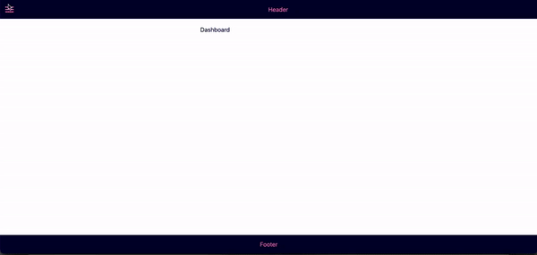

# Next.js Dashboard Layout template (with Styled Components)



[](https://vercel.com/new/clone?repository-url=https%3A%2F%2Fgithub.com%2FKaterinaLupacheva%2Fnextjs-dashboard-layout)

Starter code with the implementation of:

- Basic layout: header, the main content area with drawer, footer
- Drawer toggle
- Multilevel (nested) [menu](#menu)
- [Theming](#theme)

## Technologies used

- Next.js v.12
- TypeScript v.4
- Styled Components v.5
- Styled Icons (Material) v.10

### Menu

To change (add/remove) menu options, open `constants/menu-items.ts` file, and edit **MENU_OPTIONS** variable by updating a name, url and icon props. Any menu item can have nested options (_subItems_ array). There is no menu depth limit (although some additional styling might require for 3+ levels). The template will generate a menu structure automatically based on the provided **MENU_OPTIONS**.

### Theme

To add/remove/change any theme colors (or add any other theme props, like font-size, border-radius, spacing, etc.) edit `styled.d.ts` file to have type safety, and `styles/theme.ts`.

## Getting Started

1. Get the latest version:

```bash
git clone https://github.com/KaterinaLupacheva/nextjs-dashboard-layout.git
cd nextjs-dashboard-layout
```

2. Run

```bash
npm install
```

3. Start the development server:

```bash
npm run dev
```

4. Open http://localhost:3000 to view it in the browser.

## How to create from scratch

I wrote the blog post on how to create the Dashboard layout. You can read it [here](https://ramonak.io/posts/nextjs-dashboard-layout).
